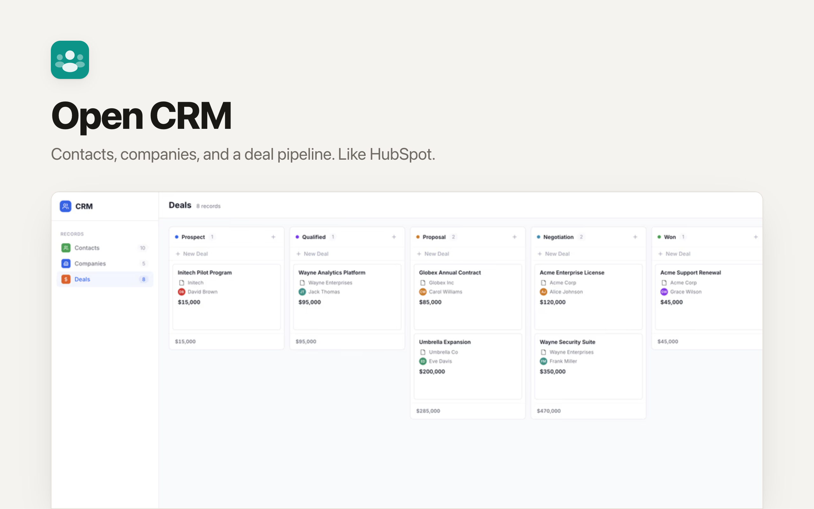
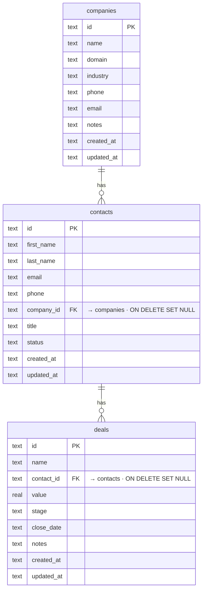

# OpenClaw CRM App: The Open-Source HubSpot Alternative for SaaS

A lightweight CRM with contacts, companies, and deals — built for SaaS dashboards and AI agents. Part of the [OpenClaw](https://github.com/openclaw/openclaw) ecosystem. Zero cloud dependencies — runs locally with SQLite.

Built with **React + Tailwind + shadcn/ui** on **Hono + Cloudflare D1**. Path-based routing, UUID keys, a dark mode that follows the OS, and a dual-mode UI: one for humans and one for AI agents (larger targets, always-visible actions).

## What Is It?

Clawnify CRM App is a production-ready contact relationship manager designed for the OpenClaw community. Think of it as an open-source HubSpot alternative — a CRM you can self-host, customize, and embed in any SaaS product.

Unlike HubSpot or Salesforce, this runs entirely on your own infrastructure with no API keys, no vendor lock-in, and no per-seat pricing. It provides a complete sales pipeline and lead management system. Manage contacts, companies, and deals with rich column types, inline editing, and full CRUD — all out of the box.

## Features

- **Three entities** — contacts, companies, and deals with foreign-key relationships (UUID keys, not enumerable ids)
- **Activity timeline** — every contact/company/deal has a feed; emails, meetings, notes, and deal-won events all log to it
- **Integrations (Clawnify connections)** — email a contact via Gmail, schedule a Google Calendar meeting, and post to Slack when a deal is won — all through the org's Clawnify connections, no keys in the app
- **CSV / XLSX import** — upload a spreadsheet, map columns to fields (exact-match auto-mapping), preview, import; company names resolve to existing companies or are created
- **Deal pipeline** — a board tracking deals through stages (prospect → qualified → proposal → negotiation → won/lost) with per-column totals
- **Path routing** — deep-linkable views and records (`/contacts/:id`)
- **Rich cells** — avatars, category badges, company favicons, tabular currency, email/phone links
- **Sorting, search, pagination** — server-side, debounced
- **Dual-mode UI** — human-optimized + AI-agent-optimized (`?agent=true`); dark mode follows the OS

## Quickstart

```bash
git clone https://github.com/clawnify/open-crm.git
cd open-crm
pnpm install
pnpm run dev
```

Open `http://localhost:5175` in your browser. Data persists in `data.db`.

### Agent Mode (for OpenClaw / Browser-Use)

Append `?agent=true` to the URL:

```
http://localhost:5175/?agent=true
```

This activates an agent-friendly UI with:
- Explicit "Edit" / "Delete" buttons on every row (no hover-to-reveal)
- Larger click targets for reliable browser automation
- Always-visible action buttons
- Semantic labels on all interactive elements

The human UI stays unchanged — hover-to-reveal actions, compact spacing, and a clean interface.

## Tech Stack

| Layer | Technology |
|-------|-----------|
| **Frontend** | React 19, Tailwind v4, shadcn/ui, TypeScript, Vite |
| **Backend** | Hono on Cloudflare Workers |
| **Database** | Cloudflare D1 (SQLite) via `@clawnify/db` |
| **Integrations** | `@clawnify/connections` (Gmail, Google Calendar, Slack) |
| **Icons** | Lucide |
| **Favicons** | Favicone |

### Prerequisites

- Node.js 20+
- pnpm (or npm/yarn)

## Architecture

```
src/
  server/
    schema.sql  — SQLite schema (companies, contacts, deals)
    db.ts       — SQLite wrapper + seed logic (5 companies, 10 contacts, 8 deals)
    index.ts    — Hono REST API (full CRUD for all three entities + stats)
  client/
    app.tsx             — Root component + agent mode detection
    context.tsx         — Preact context for CRM state
    hooks/use-crm.ts    — Multi-entity state management
    components/
      sidebar.tsx         — Entity navigation with count badges
      toolbar.tsx         — Entity title + search + add button
      data-table.tsx      — Table orchestrator
      contacts-table.tsx  — Contact rows (avatar, company, status pill)
      companies-table.tsx — Company rows (favicon, industry pill, contact count)
      deals-table.tsx     — Deal rows (contact, value, stage pill, footer totals)
      add-form.tsx        — Slide-down forms for adding records
      pill.tsx            — Colored status/stage pill
      avatar.tsx          — Initial-based colored avatar
      entity-icon.tsx     — Company favicon with letter fallback
      pagination.tsx      — Page controls
```

### Data Model

Three entities with foreign key relationships:



```sql
companies (id, name, domain, industry, phone, email, notes)
contacts  (id, first_name, last_name, email, phone, company_id → companies, title, status)
deals     (id, name, contact_id → contacts, value, stage, close_date, notes)
```

Contacts belong to companies. Deals belong to contacts (and inherit the company). Deleting a company sets `company_id` to NULL on its contacts. Deleting a contact sets `contact_id` to NULL on its deals.

### API Endpoints

| Method | Endpoint | Description |
|--------|----------|-------------|
| GET | `/api/stats` | Aggregate counts and total deal value |
| GET | `/api/contacts` | List contacts (paginated, sortable, searchable) |
| POST | `/api/contacts` | Create a contact |
| PUT | `/api/contacts/:id` | Update a contact |
| DELETE | `/api/contacts/:id` | Delete a contact |
| GET | `/api/companies` | List companies (paginated, sortable, searchable) |
| POST | `/api/companies` | Create a company |
| PUT | `/api/companies/:id` | Update a company |
| DELETE | `/api/companies/:id` | Delete a company |
| GET | `/api/deals` | List deals (paginated, sortable, searchable) |
| POST | `/api/deals` | Create a deal |
| PUT | `/api/deals/:id` | Update a deal |
| DELETE | `/api/deals/:id` | Delete a deal |

## Community & Contributions

This project is part of the [OpenClaw](https://github.com/openclaw/openclaw) ecosystem. Contributions are welcome — open an issue or submit a PR.

## License

MIT
